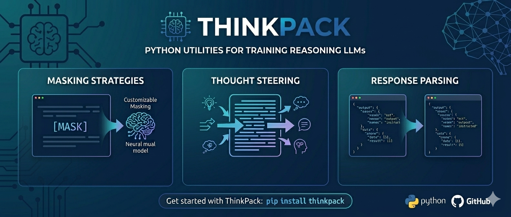

# `thinkpack`



[](https://github.com/itsluketwist/thinkpack/actions/workflows/lint.yaml)
[](https://github.com/itsluketwist/thinkpack/actions/workflows/test.yaml)
[](https://github.com/itsluketwist/thinkpack/actions/workflows/release.yaml)

A framework for training, parsing, and evaluating explicit reasoning models — centred on **reasoning collapse**.

`thinkpack` provides four focused modules:

- 🎭 **[Loss masking](#thinkpackmask--training-time-loss-masking)** (`thinkpack.mask`) — the core method; prevents reasoning collapse during fine-tuning by masking think blocks from the loss.
- 🔍 **[Response parsing](#thinkpackparse--response-parsing)** (`thinkpack.parse`) — splits raw model output into reasoning and answer components, with flags for presence, validity, and truncation.
- 📊 **[Statistics](#thinkpackstats--response-statistics)** (`thinkpack.stats`) — aggregates parsed responses into AR and VR rates, making reasoning collapse measurable.
- 🔮 **[Thought steering](#thinkpacksteer--inference-time-thought-steering)** (`thinkpack.steer`) — injects a short primer at inference time to seed the model's reasoning trace.

---

## *reasoning collapse*

**Reasoning collapse** is a failure mode that occurs when fine-tuning reasoning-enabled models on standard instruction–response data:

> The model learns to skip its reasoning block entirely — producing answers directly without a `<think>` trace.

This happens because the response alone is sufficient to minimise cross-entropy loss. The reasoning block provides no training signal and becomes an obstacle the model learns to avoid.

```
before fine-tuning:   x → <think>reasoning</think> answer
after naive SFT:      x → answer
```

ThinkPack makes this phenomenon **observable**, **measurable**, and **preventable**.

---

## *installation*

Requires [Python 3.11+](https://www.python.org/), install directly from [PyPI](https://pypi.org/project/thinkpack/):

```bash
pip install thinkpack
```

---

## *modules*

### `thinkpack.mask` — Training-time loss masking

The core method. When fine-tuning a reasoning model, `mask()` formats training records into a pretokenized HuggingFace dataset with selected sections excluded from the loss. Masking the think block prevents the model from learning to skip it.

```python
import thinkpack

# masking-based SFT — prevents reasoning collapse
dataset = thinkpack.mask(
    records=records,    # list of dicts with "instruction" and "response" keys
    tokenizer=tokenizer,
    masked=thinkpack.Mask.THINK,  # mask the think block from the loss
)

# naive SFT — causes reasoning collapse (use as baseline)
naive_dataset = thinkpack.mask(
    records=records,
    tokenizer=tokenizer,
    masked=None,  # no masking — all tokens contribute to the loss
)
```

The `masked` parameter is a composable flag — combine sections with `|`:

| Value | Effect |
|---|---|
| `Mask.THINK` | Think block hidden from loss; model trains on prompt + response |
| `Mask.PROMPT \| Mask.THINK` | Train on response only |
| `None` | No masking; all tokens contribute to the loss (naive baseline) |

Model-specific template handling (Qwen3's native `reasoning_content` field, OLMo-3's auto-injected opening tag) is detected automatically from the tokenizer — no manual configuration needed.

See [examples/training.py](examples/training.py) for a complete comparison of naive vs masking-based SFT.

---

### `thinkpack.parse` — Response parsing

Parse raw model outputs into structured components. Each `ParsedResponse` carries flags that directly support reasoning collapse analysis.

```python
# single response
parsed = thinkpack.parse(response=raw_text)
parsed.answer                   # str — text after the closing reasoning tag
parsed.reasoning                # str — content of the reasoning block
parsed.has_reasoning_block      # bool — any block structure present (→ AR)
parsed.has_valid_reasoning      # bool — non-empty, completed reasoning block (→ VR)
parsed.has_truncated_reasoning  # bool — reasoning block opened but never closed

# directly from vLLM output objects (single output → list, list of outputs → list[list])
parsed = thinkpack.parse_output(output=outputs)
```

Handles all four output formats:

| Format | Example |
|---|---|
| Standard | `<think>reasoning</think>answer` |
| Prefixed template | `reasoning</think>answer` (opening tag injected by template) |
| Truncated standard | `<think>reasoning...` (no closing tag) |
| Truncated prefixed | `reasoning...` (pass `prefixed=True`) |

Recognises tag variants: `think`, `thinking`, `reasoning`, `thought` (case-insensitive).

---

### `thinkpack.stats` — Response statistics

Aggregates a batch of parsed responses into counts, exposing the **AR** and **VR** rates used to measure reasoning collapse.

```python
parsed = thinkpack.parse_all(responses=responses)
s = thinkpack.stats(responses=parsed)

# reasoning collapse metrics
s.has_reasoning_block      # int — responses with any reasoning block (AR numerator)
s.has_valid_reasoning      # int — responses with complete, non-blank reasoning (VR numerator)
s.total                    # int — total responses (denominator)

# AR and VR rates
ar = s.has_reasoning_block / s.total   # any reasoning rate
vr = s.has_valid_reasoning / s.total   # valid reasoning rate

# additional breakdown
s.has_truncated_reasoning  # int — block opened but never closed
s.has_empty_reasoning      # int — block opened and closed, but blank
s.has_answer               # int — non-blank answer produced
```

The three reasoning block states (`has_truncated_reasoning`, `has_empty_reasoning`, `has_valid_reasoning`) are mutually exclusive and sum to `has_reasoning_block`. `stats()` accepts either a flat `list[ParsedResponse]` or the nested `list[list[ParsedResponse]]` shape returned by `parse_all()`.

**Key metrics for the paper:**

| Metric | Definition | Interpretation |
|---|---|---|
| **AR** | `has_reasoning_block / total` | Fraction with any reasoning present |
| **VR** | `has_valid_reasoning / total` | Fraction with structurally valid reasoning |
| **pass@1** | accuracy on first sample | Standard answer correctness |
| **Rpass@1** | accuracy among VR=True samples | Accuracy conditioned on valid reasoning |

Reasoning collapse is observable as VR → 0 over training steps or data size.

See [examples/inference.py](examples/inference.py) for a complete collapse measurement pipeline.

---

### `thinkpack.steer` — Inference-time thought steering

Injects a short prefix after the opening reasoning tag at inference time, seeding the model's thought before it generates its own reasoning content. Useful when a model has partially collapsed — a nudge can reinstate reasoning.

```python
# ensure the opening reasoning tag is present (no prefix)
steered_prompts = thinkpack.steer(
    prompts=templated_prompts,  # already chat-templated strings
    tokenizer=tokenizer,
)

# seed the model's thought with a preset
steered_prompts = thinkpack.steer(
    prompts=templated_prompts,
    tokenizer=tokenizer,
    prefix=thinkpack.SimplePrefix.CONCISE,
)

# or pass any custom string
steered_prompts = thinkpack.steer(
    prompts=templated_prompts,
    tokenizer=tokenizer,
    prefix="Okay, let me think through this carefully.",
)
```

`SimplePrefix` provides a few basic presets:

| Preset | Text |
|---|---|
| `BRIEF` | `"Okay, "` |
| `STEPS` | `"Okay, let me think this through step by step."` |
| `CONCISE` | `"Okay, let me think this through, but I need to be concise and make sure I also provide an answer."` |

`apply_steer_template()` combines chat template application and steering in one call:

```python
steered_prompts = thinkpack.apply_steer_template(
    conversations=conversations,  # list of message dicts
    tokenizer=tokenizer,
    prefix=thinkpack.SimplePrefix.STEPS,
)
```

---

## *agent skill*

`thinkpack` ships with an `llms.txt` file and a CLI command to install it as an agent skill in your project.
This gives AI coding assistants (Claude Code, Cursor, Windsurf) immediate, accurate context about the library.

Install the skill for your preferred tool from your project root:

```bash
thinkpack skill --tool claude     # .claude/commands/thinkpack.md
thinkpack skill --tool cursor     # .cursor/rules/thinkpack.mdc
thinkpack skill --tool windsurf   # .windsurf/rules/thinkpack.md
```

Or print the raw `llms.txt` content to stdout:

```bash
thinkpack skill
```

---

## *development*

Clone the repository:

```shell
git clone https://github.com/itsluketwist/thinkpack.git
```

We use [`uv`](https://astral.sh/blog/uv) for project management.
Once cloned, create a virtual environment and install with dev dependencies:

```shell
python -m venv .venv

. .venv/bin/activate

pip install uv

uv sync
```

Use `make` commands to lint and test:

```shell
make lint

make test
```
